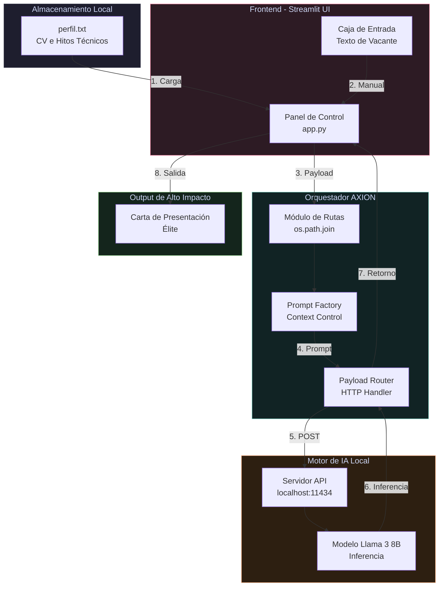

# 🌌 AXION
> **Aplicacion cero cloud para la utomatizacion de los procesos de reclutamiento**
> 
> ✨ *Particula de invisibilidad cuántica: transformando candidatos en ofertas insuperables*

<div align="center">


**[Inicio Rápido](#instalación-y-configuración-paso-a-paso)** • **[Características](#características-principales)** • **[Arquitectura](#arquitectura-del-sistema-y-funcionamiento)** • **[Guía de Uso](#instrucciones-de-uso-diario)**
</div>

---

## ¿Por qué AXION?

<table align="center">
<tr>
<td width="50%">

### La Partícula Subatómica

En la física teórica, un **Axión** (*axion*) es una partícula hipotética que resuelve problemas fundamentales de simetría en el universo. **Extremadamente ligera, invisible, silenciosa**.(Al igual que esta aplicacion que resuelve de forma ligera y silenciosa la creacion de cartas de presentacion)**

</td>

</tr>
</table>

### Los tres Pilares Fundamentales

| | |                                          |
|:---:|:---:|:-----------------------------------------------------------:|
| **Resolución Silenciosa** | **Estructura Cuántica** |                  **Masa Cero (Zero-Cloud)**                 |
| El sistema opera invisible en tu hardware local | No genera spam ni cartas genéricas. Ajusta tu perfil técnico real con vectores de la oferta | Inferencia local pura. Sin APIs de pago, privacidad absoluta |
| | |                                          |

---

## Arquitectura del Sistema y Funcionamiento

AXION no es una simple interfaz de chat. Es un **pipeline estructurado de datos** que automatiza la ingeniería de contexto sin intervención humana.

### Diagrama de Flujo de Datos estructurado:



---

### Componentes Clave del Sistema

<table>
<tr>
<td width="25%">

#### Frontend
**Streamlit UI**

Interfaz reactiva y limpia. Pegado rápido de ofertas de:
- InfoJobs
- LinkedIn
- Portales corporativos

</td>
<td width="25%">

#### Orquestador Central
**Python Core**

- Calcula rutas absolutas
- Valida integridad de datos
- Encapsula payloads HTTP
- Control de contexto estricto

</td>
<td width="25%">

#### Filtro de Alucinación
**Logical Firewall**

Si una tecnología no existe en tu perfil:
- AXION prohíbe mentir
- Activa "Lógica de Trinchera"
- Usa proyectos complejos como puente

</td>
<td width="25%">

#### Motor IA Local
**Ollama + Llama 3**

- Processing 100% local
- Sin APIs externas
- Privacidad garantizada
- Puerto: 11434

</td>
</tr>
</table>

---

### Componentes Clave:

---

## La Artillería Técnica Inyectada

El verdadero poder de AXION radica en cómo gestiona y vende la complejidad técnica del candidato, estructurando el contexto en bloques de alto impacto:

### Bloques de Contexto Disponibles

|                  Bloque                  |  Stack Técnico | Fortalezas Proyectadas                                                                                           |
|:----------------------------------------:|:---:|:-----------------------------------------------------------------------------------------------------------------|
|   NEURO-FOCUS <br/> *(TFC Principal)*    | OpenCV • MediaPipe<br/>Filtros de Kalman<br/>PySerial • Hardware Biométrico | Lógica dura<br/> Matemáticas avanzadas<br/> Control bajo nivel<br/>→ *Ideal: C++, Backend, Sistemas*             |
| VIRTUAL REALITY<br/> *(Especialización)* | WebXR • Real-time Optimization<br/>Arquitectura OOP avanzada<br/>Gestión de memoria | Asimilación rápida<br/> Arquitecturas complejas<br/> Performance expertise<br/>→ *Ideal: Game Dev, 3D, Graphics* |
|    SOFT SKILLS<br/> *(Diferenciador)*    | Artes marciales • Competición<br/>Resiliencia probada<br/>Disciplina extrema | Aprendizaje ultrarrápido<br/> Adaptabilidad<br/> Mentalidad de crecimiento<br/>→ *Ideal: Startups, Escalada*     |

---

##  Instalación y Configuración (Paso a Paso)

Sigue estos pasos para levantar tu propia instancia corporativa de AXION en tu máquina local:

###  Requisitos Previos del Sistema

<div align="center">

|   Requisito    | Versión Mínima |
|:--------------:|:---:|
|     Python     | 3.10+ |
|     Ollama     | Latest |
| Almacenamiento | 10GB (modelo + datos) |
|      RAM     | 8GB (16GB recomendado) |

</div>

###  Configuración del Entorno de IA

Descarga y arranca el modelo de lenguaje de forma **100% local**:

```bash
# Descargar e iniciar Llama 3 (primera vez ~5-10 min)
ollama run llama3
```
>[!IMPORTANT]
> Mantén la instancia de Ollama activa en segundo plano → Servirá peticiones en `localhost:11434`

### Clonar el Proyecto e Instalar Dependencias

```bash
# Clonar repositorio
git clone https://github.com/isaaccsugus-spec/axion.git
cd axion

# Instalar dependencias Python
pip install -r requirements.txt
```

###  Preparación del Core de Datos

Crea un archivo `perfil.txt` en la raíz del proyecto:

```plaintext
# perfil.txt - Tu CV Técnico Estructurado

## EXPERIENCIA CLAVE
- Neuro-Focus: Visión artificial con OpenCV, integración hardware biométrico
- Virtual Reality: Optimización de rendimiento, WebXR

## HITOS TÉCNICOS
- TFC: Sistema embebido en Python + C++
- Proyectos VR en entornos complejos
```

###  Despliegue de la Aplicación

Arranca el servidor web local:

```bash
streamlit run app.py
```
> [!NOTE]
> Automáticamente abre: `http://localhost:8501`

---

##  Instrucciones de Uso Diario

### Flujo de Trabajo en 5 Pasos

<table align="center">
<tr>
<td align="center">Abre AXION</td>
<td align="center">/>Copia Oferta</td>
<td align="center">Pégala</td>
<td align="center">Genera</td>
<td align="center">Envía</td>
</tr>
<tr>
<td align="center">UI Web<br/>http://localhost:8501</td>
<td align="center">InfoJobs<br/>LinkedIn<br/>Portal</td>
<td align="center">En la caja<br/>de texto</td>
<td align="center">Click en<br/> Generar</td>
<td align="center">Copia lista<br/>sin jerga IA</td>
</tr>
</table>

### Proceso Detallado

```
1. Abre la interfaz web de AXION (http://localhost:8501)

2. Copia el texto COMPLETO de la oferta que te interesa:
   ├─ Requisitos
   ├─ Descripción del puesto
   ├─ Empresa
   └─ Stack tecnológico

3. Pégalo en la caja de texto del panel de control

4. Haz clic en el botón  "Generar Carta de Alto Impacto"

5. AXION procesa:
   ├─ Análisis de vectores de la oferta
   ├─ Mapeo a tu perfil técnico (perfil.txt)
   ├─ Activación de "Lógica de Trinchera" si es necesario
   ├─ Inferencia local con Llama 3
   └─ Filtrado de alucinaciones

6. Recibes una CARTA REFINADA:
    Adaptada a la oferta específica
    Sin lenguaje robótico de IA
    Llave a tu perfil técnico real
    Lista para copiar y enviar
```

---

## Características Principales

<div align="center">

| Feature                             | Status | Descripción |
|:------------------------------------|:---:|:---|
| Generación de Cartas Personalizadas | ✅ | Adaptación automática a cada oferta |
| Filtro Anti-Alucinación             | ✅ | Valida tecnologías antes de mencionar |
| Análisis Vectorial                  | ✅ | Mapea requisitos VS perfil |
| Almacenamiento Local                | ✅ | 100% privacidad, cero datos en la nube |
| Inferencia Local                    | ✅ | Ollama + Llama 3 en tu máquina |
| UI Streamlit                        | ✅ | Interfaz limpia y reactiva |
| Multi-Perfil                        | 🔄 | Soporte para múltiples CV (próx.) |
| Export a PDF                      | 🔄 | Descarga directa (próx.) |

</div>

---

## Seguridad y Privacidad

<div align="center">

### La Filosofía AXION: Soberanía del Código

```
┌─────────────────────────────────────┐
│  TU MÁQUINA - TOTAL CONTROL        │
│  ┌───────────────────────────────┐ │
│  │ Datos Personales              │ │
│  │ CV & Proyectos                │ │
│  │ Intenciones de Búsqueda       │ │
│  │ Cartas Generadas              │ │
│  └───────────────────────────────┘ │
│               HERMÉTICO            │
│     NUNCA SALE DE TU HARDWARE      │
└─────────────────────────────────────┘
```

</div>

 **Garantías de Privacidad:**
-  **NO** se envía datos a servidores externos
-  **NO** se utilizan APIs comerciales de pago
-  **NO** se entrena modelos comerciales con tus datos
-  **TODO** funciona 100% local
-  **TÚ** controlas absoluta y totalmente tu información

---

##  Soporte y Contribuciones

<div align="center">

|  Email                 |  GitHub |  errores                  |
|:-------------------------|:---|:----------------------------|
| sugussanchez31@gmail.com | @isaaccsugus-spec | Sugerencias /ideas /errores |

</div>

---


<div align="center">

###  Hecho por Isaac

*"La verdadera IA es invisiblE ya que es aquella que resuelve tu problema sin que tengas que pensar en ella."*


</div>
